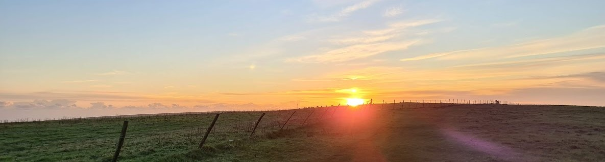

Well, I did it, I've finished all my assignments from the University of Sussex with a Bachelor's degree in Computer Science with Artificial Intelligence, the only thing left is to attend my graduation ceremony in July. As the first person in my family to earn a university degree, I couldn't be prouder of myself.  I'm also immensely grateful to my parents for their unwavering support throughout life, which has led me to where I am today. This blog post is a bit less formal than usual. Think of it as a "wall of text" where I share my journey, how I found success, and the meaningful connections I made during my time at university.

To understand my university journey, we have to rewind to life before university. During my A level exams, I knew I wanted to work in tech and wasn't too motivated to continue academia. So, I did what any student in my shoes would do and applied for jobs instead of revising. This landed me my first job at [Tradeviews](https://tradeviews.net), where I scraped websites and worked with data in VBA and Python. After about a year, I would go on to do natural language processing work at [FinancialJuice](https://www.financialjuice.com/home) to identify trending and related news. Once my contracts were completed, I took a leap of faith and enrolled in a foundation year in computer science at university.

Working at startup sized companies prior to university really taught me how to take initiative, the importance of enjoying the fast-paced culture and learning to wear many hats, which would be crucial skills I would continue to apply throughout my future experiences.

# Foundation Year

My foundation year started with around 30 students, but only four of us attended classes in person. Little did I know that two of those classmates would become close friends, staying with me throughout my entire degree. I also joined HackSussex, the largest student-led informatics society at Sussex, invited by an old college friend and took on the task to rebuild the committee website. HackSussex played a pivotal part in meeting more like-minded individuals in the School of Informatics. My goal during the foundation year was simple; learn the facilities, get to know the staff, and develop a student-like routine. I'd say I achieved these well, having built my first [GitBook](https://adnantech.gitbook.io/university-notes/-MRQULtOLYU5lI8KtH0S/) to document and share my notes during studying, and formed a bond with my foundation year lecturers. The summer of my foundation year was really about creating more software and stepping foot into the world of financial technology, starting with building algorithmic trading projects after reading [Python for Algorithmic Trading by Yves Hilpisch](https://www.oreilly.com/library/view/python-for-algorithmic/9781492053347/).

Sadly, I lost my Grandma during 2020. If you’re from an Asian heritage, you know how much grandparents mean to us. I decided to try and find happiness by spending more time with loved ones and working even harder, knowing my grandma would be proud.

# First Year

The first year of my Bachelor's degree was pretty smooth sailing, thanks to the solid *foundation* I had built during my foundation year. Therefore, I worked on more finance related projects throughout the year and passed my exams with flying colours. During this semester, I also took part in my first hackathon hosted by Showcode, which focused on improving education, you can [read more about it here](https://adnanquisar.com/study-quest/). After I finished my exams, I started looking for a minimum-wage job to make some pocket money, that is when I was approached on LinkedIn for a summer software engineering internship at [Thought Machine](https://www.thoughtmachine.net/), a cloud-native core banking startup. I went through the interview rounds and accepted the offer, commuting into the heart of London for 10 weeks over summer.

## Thought Machine

My experience at Thought Machine was nothing short of spectacular, as a first year from the University of Sussex I felt out of depth compared to my peers who went to the top universities in the UK and had more years of higher level education under their belt. Nevertheless, with a great manager and supportive team I learnt a ton about software engineering in an environment that emphasised communication and teamwork. Being in the Payments department almost felt like a startup within a startup. I managed to organise coffee chat with a plethora of talented individuals  all across the company, including the CTO, CFO, product managers and engineers. I presented my project live to company offices around the world, including the CEO.

From a technical perspective, I worked on a library to optimise building graphs along with an observability dashboard for product feedback, using agile methodologies and test-driven development. From a career perspective, I grew tremendously, Thought Machine exceeded my expectations by giving me the opportunity to work on impactful projects that I know won't be shelved just because it's an "intern project". Going from working in small companies to an engineering focused scale-up company was eye opening, and I am incredibly grateful for the connections I made during my internship. My hard-work was recognised and my feedback was excellent, I finished the internship with a burning passion and was ready to take on my second year.

# Second Year

My second year was jam-packed. I passed the interview stage and accepted the offer to become a Peer Assisted Learning (PAL) tutor, this was a fantastic opportunity to revise prior modules alongside my current studies, meet new students and earn some money. Additionally, I applied my skills gained at Thought Machine to manage a talented team of 5 peers to build a full-stack web application for our software engineering project, Settlers of Catan. Not only did we achieve the highest grade in our cohort, we did it with a unique method no other team used, which was chosen in alignment with career growth and exploration for us. Thanks to the conversations with my manager at Thought Machine, I was given advice and taught frameworks on how to deal with situations that would arise as a manager. However, this was my first experience of managing, even with all the prior advice given to me and a great team, it was still a challenging task to make the magic happen, sprints were really sprints and time management felt difficult as we had other modules to juggle on top of the large scoped project.

On a personal note, I took a trip back to Pakistan for my brother's wedding. Although I travelled in the middle of coursework season, it was a refreshing experience to be away from work and reconnect with my roots.

## ICHack & HackSussex

My second year also included participating in [Imperial's Hackathon, ICHack 23](https://adnanquisar.com/ichack-23/). I also got to experience the other side of the coin by helping organise and run the HackSussex hackathon as Vice-President of the society. Both experiences had their own rewards, I loved the thrill of competition and found joy in seeing other people's projects come to life, assisting teams wherever I could. The second round of organising a large scale event came along with the HackSussex GameJam. Along with tutoring, these extra-curricular activities had really taken over a large portion of my schedule, but I loved it. I got to connect with new people and really got to see witnessed personal growth and growth in others.

Fast forward to the summer of my second year, I took on two opportunities the summer of my second year, the first was a [junior research associate project on analysing news headlines and market movement](https://adnanquisar.com/time-is-money/). The second opportunity was with [Groov, a jukebox app idea](https://adnanquisar.com/groov/), which aimed to feed my entrepreneurial drive as I'd be doing research the majority of summer. Oh, and I managed to squeeze in a trip to Dubai with two close friends, exploring the UAE and immersing ourselves in the culture.

# Third Year

Finally, my third year, the home-stretch. For my dissertation project, I proposed my own idea, a financial technology project to [forecast crude oil inventories using news headlines](https://adnanquisar.com/crude-oil-inventory-forecasting/), that would use a combination of skills I had learnt since I was 18. The results were inconclusive, but I learned a lot and now know how to pivot the project from here for a higher chance of success. I also took on teaching assistant roles for 3 modules over the 2 terms, natural language engineering, computer vision, acquired intelligence and adaptive behaviour. Natural language engineering was by far the module I was most confident in, and computer vision required more preparation prior to the lab sessions in order to be refreshed on the course material.

However, at this point, things started to become tough, I had taken on too many extra-curriculars and couldn't keep up. So I made the strategic decision to cut back my extra curriculars and refocus on my original goals, earning my degree and boosting my career opportunities. I also competed in the 2024 coders cup, although my performance wasn't stellar, I think life is about experiences, and I can now say I've been in both the commentating seat, as well as the competing seat.

So, my degree has finished. Where do I go from here? Now it's time to close the chapter and start writing a new one. I'll be travelling to Los Angeles this summer and I've accepted an offer to work as a Junior Software Engineer at Macquarie group in the heart of London. To be honest, submitting my last assignment felt surreal, after you drag and drop the one Jupyter Notebook file your journey ends, no confetti, no applause, you just stare at the screen and realise the journey over the last four years is now over. However, now 

# Advice to Undergraduates

If you're currently studying as an undergraduate somewhere in the world reading this, keep working hard. Hard work never goes to waste. There are days when the workload feels like a mountain and all the work you are doing is not worth the effort, but I would disagree. The universe is extremely giving when you dedicate yourself to something, and will reward those who perservere. Also, don't forget to appreciate the kind people you'll meet on your journey, they'll make the journey much easier and more enjoyable. Finally, remember that you are always worth infinitely more than the degree you'll eventually earn, don't define yourself by your grades, but instead by the passion, the kindness, and the unique spark you bring to the world.