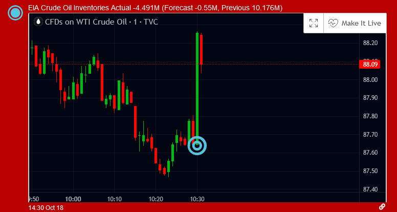
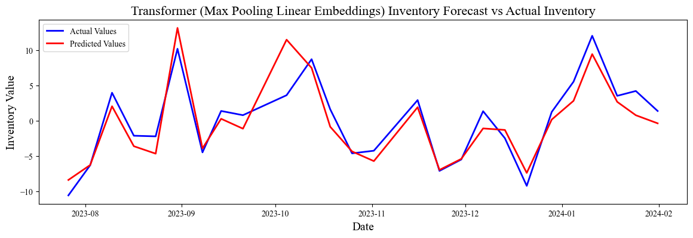

My Bachelor’s Thesis is titled "Inventory Forecasting in the Crude Oil Market with Machine Learning", the project takes weekly U.S. Crude Oil Inventories forecasts future inventory values using deep neural networks, incorporating inventory driver features and novel natural language features derived from breaking financial news headlines to improve forecasting.

Crude oil is the most traded commodity in the world, with $1.45T being traded in 2022, thus has an enormous amount of liquidity, providing trading opportunities. The motivation for this thesis was to find the correlation between inventory movement and market movement by forecasting the inventory ahead of time using news headlines to  achieve returns from the non-linear relationship.

Our research used the Energy Information Administration’s (EIA) weekly reports on crude oil inventories, which offer insights into U.S. oil supply levels on a weekly basis. We also leveraged the weekly preliminary report from the American Petroleum Institute’s (API). These weekly reports provide an early indication of inventory changes that can influence market expectations and assist investors in gauging the balance between supply and demand in the crude oil market.

The dataset is as follows: 159 weekly economic events were sampled with 25,530 headlines from FinancialJuice. A pre-trained RoBERTa model was used to generate aggregate sentiment values and word embeddings, further processing was done to reduce dimensions so our models would not fall short to the curse of dimensionality. Extensive hyperparameter tuning was done using Bayesian optimisation techniques and an expanding window technique was used to ensure consistency in results, and showing how well the best models perform over time.

Results from the models are largely inconclusive, likely due to three things. Firstly, the nature of financial news headlines being short in text and lacking context. Secondly, the Pre-Trained model having context of the Financial Phrasebank dataset, rather than a text corpus that better represents the supply and demand dynamics of the crude oil market. Thirdly, the small sample size of 159 release events.

However, this proposes a lot of promise, as a fine-tuned time series deep neural network model with an augmented dataset would be expected to handle the task more effectively, covering up the weaknesses of a pre-trained model, utilising the strength of models built for time series data and using the natural language expertise of transformer neural network models.