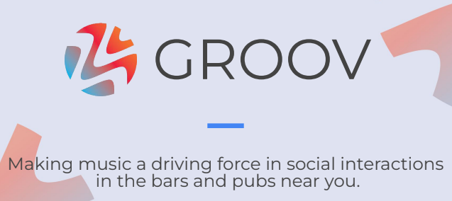

After I completed my JRA project, [Time is Money](https://adnanquisar.com/time-is-money/), I decided to feed my entrepreneurial drive during the rest of summer and worked with [Sussex's Entreprenurship Team](https://student.sussex.ac.uk/careers/entrepreneurship/funding) to spend 100 hours with a founding duo fresh out of their incubation program. The idea of Groov was straightforward, a modern day jukebox app built to drive social interactions with music, users would pay to play music in the current venue they are at to share the music they love, with additional partnerships with commercial music providers to drive revenue.

As a developer, my tasks for Groov was to bring the proof of concept to life. However, there was a spanner thrown in the works as there was no wireframe and the duo were still figuring out the brand identity. Knowing this, we decided to rewind a bit and have a meeting to consolidate our vision for the proof of concept's look and feel, I put forward the idea of using an interface design tool such as Figma, and from there the decision was made for me to take the lead on completing the wireframe for a mobile view, with collaboration from the founding duo coming later on down the line. The takeaway from this task was two fold, firstly I had learnt that not having a technical founder meant communication needed to be crystal clear. Secondly, early startups mean you get to _really_ have an impact on the future of the brand, learning a multitude of different skills beyond coding, at the cost of wearing many hats and having a heavy workload.

Lastly, I designed a prototype of the wireframe as a web app with minimal functionality. With an extensive requirements list and a dream, we had no time to waste. Progress accelerated quickly largely due to React's components system, allowing for reusable and modular sections of code to generate UI. However, the founding duo did not manage to secure the required API keys for the system. To compensate, we had another meeting to scale back the requirements, to pivot for a functional-looking wireframe to showcase to potential investors. Although I wasn't fully satisfied with the personal progress made throughout the project, I learnt about the importance of communication and reinforced the skill of learning fast, taking joy in the fast-paced feeling of startup culture. I wish the best of luck to Groov moving forwards; music can cultivate culture! 