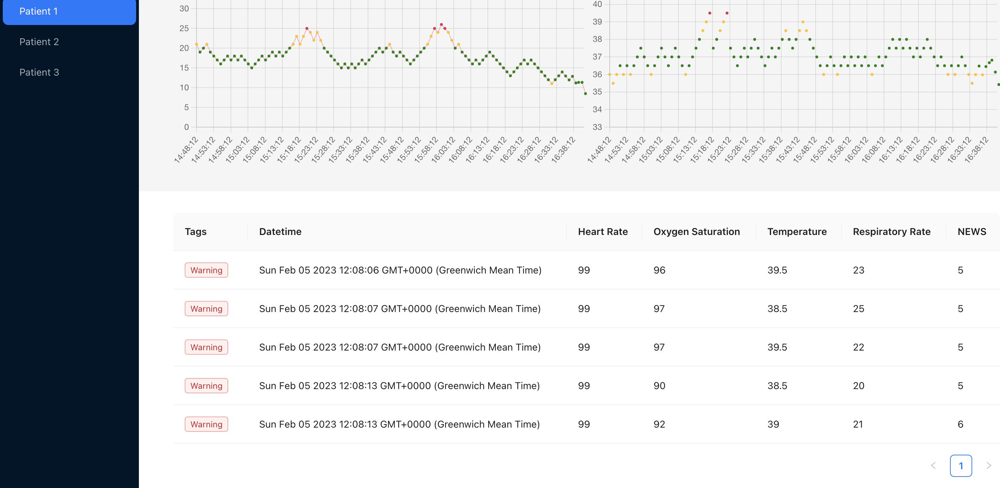
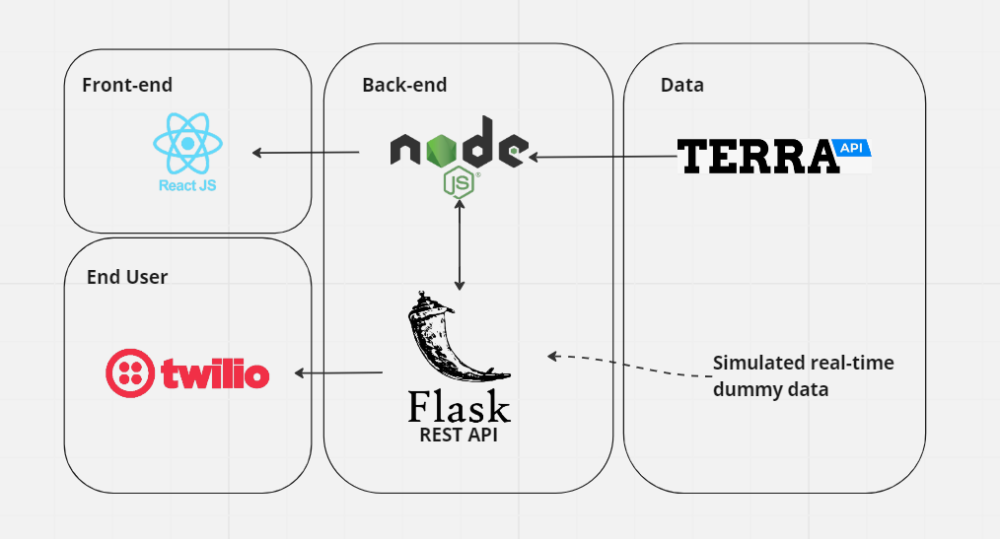

During Imperial's Hackathon, I teamed up with 5 others to take on Terra API's wearable challenge, where the goal was the most innovative hack using health data. After some brainstorming of ideas, we came up with the objective of monitoring recovery after physical surgery. My contribution to the project was simulating physiological responses with Monte Carlo methods in Python. Since only the heartrate data could be streamed with the wearable device we were given, I decided to simulate some data to to mimic real-world events. The vitals states change in response to probabilistic rules based on its current state, a stochastic process similar to Markov Chains. Essentialy using logic zones with core health metrics, we were able to generate realistic occurences of what a recovery patients vitals may look like, and warning medical professionals such as doctors and nurses if the patient's vitals reached critical logic zones. The maths for the transition equation from state to state can be defined as below.

This was then integrated into the system, and a score of the patients health was calculated, sending a notification to the medical professional to prompt an appropriate response. A key takeaway from the hackathon was the importance of scaling scope through effective communication; great achievements are possible only when everyone is aligned. Not all members of our team had a technical background, so building the bridge of communication between the technical and non-technical side was crucial to getting our project over the line. The full system overview can be seen as below.

