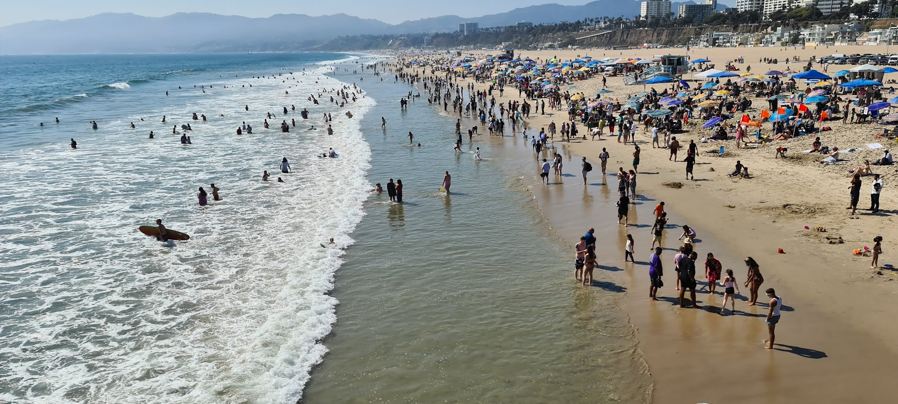
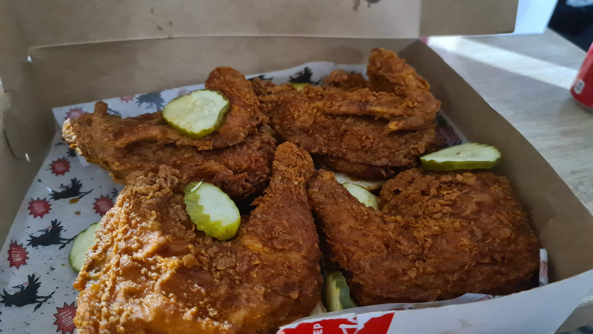
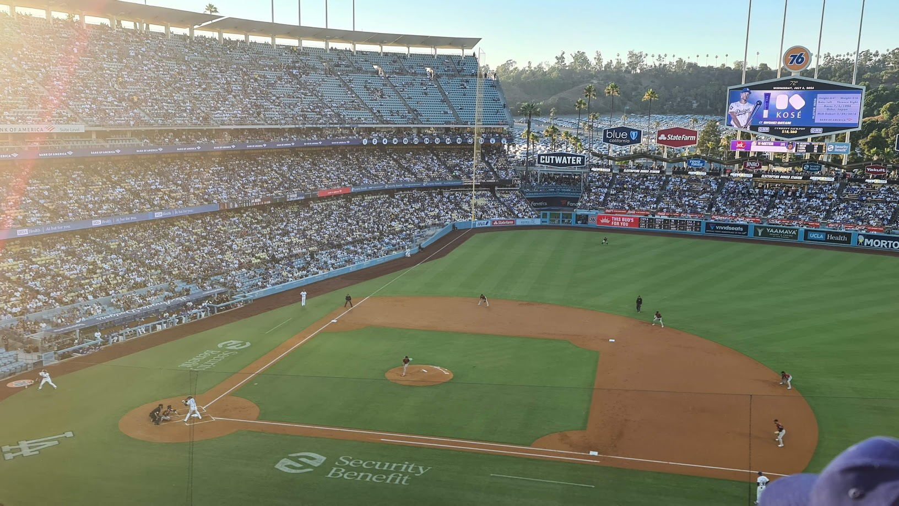
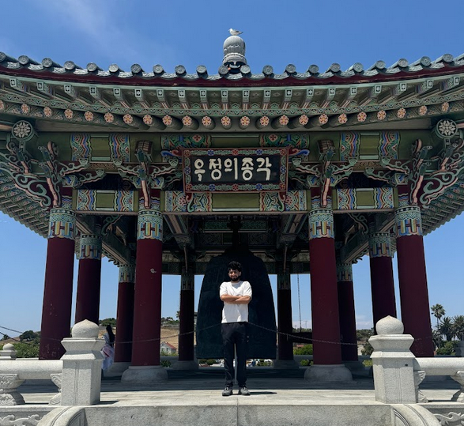
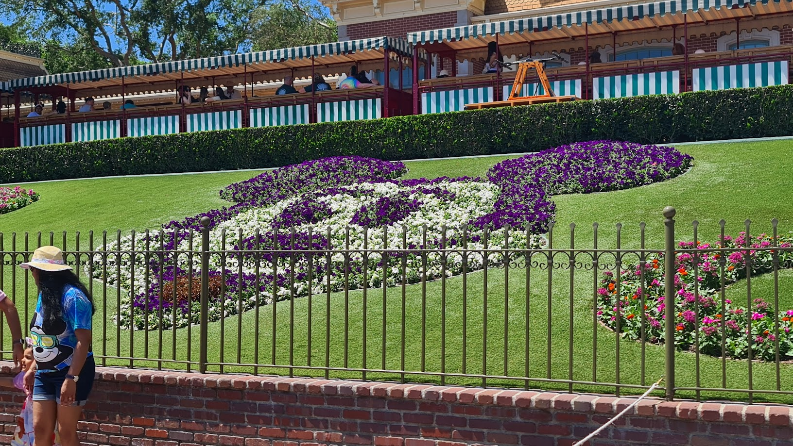
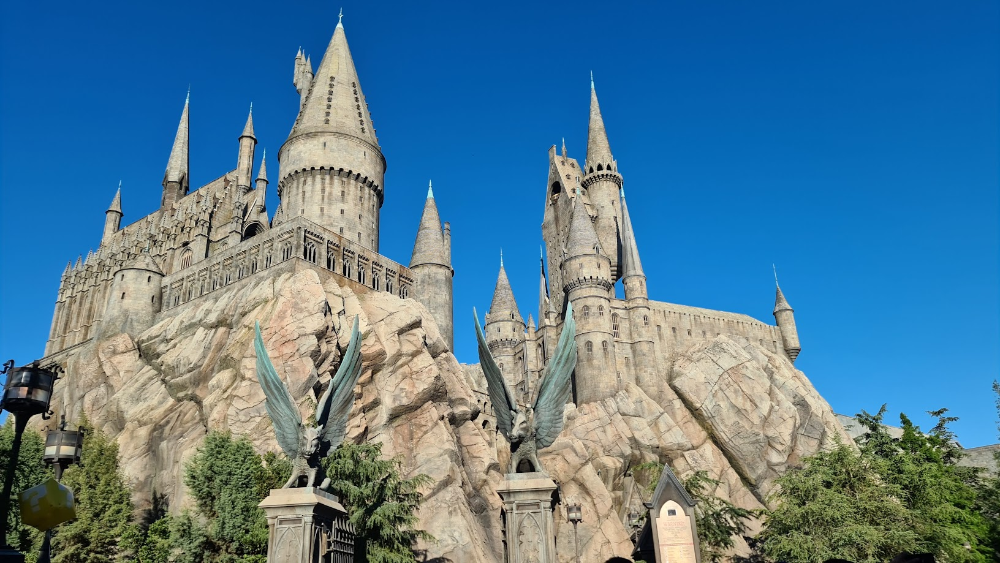
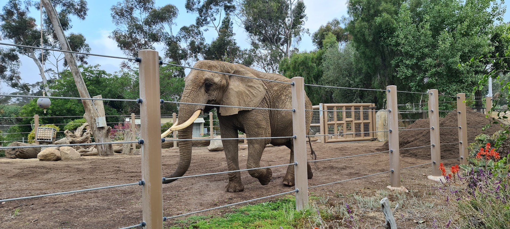
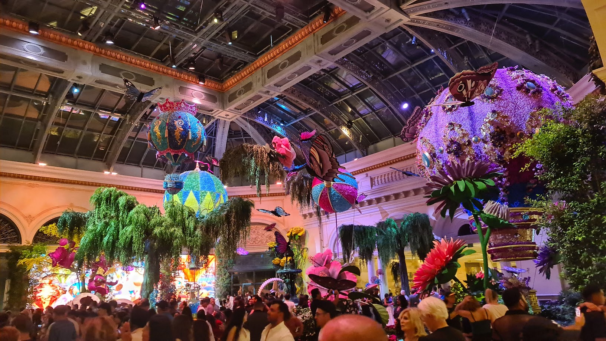
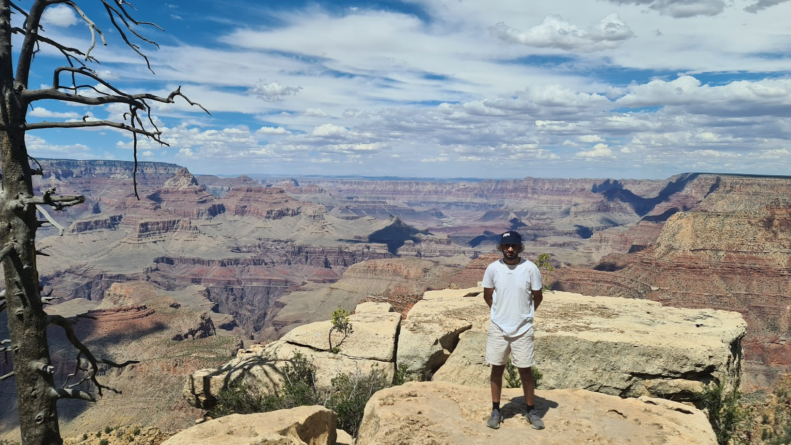

In July of 2024, I spent a whole month in the City of Angels, also known as Los Angeles. I've never been away for so long, and I never thought I would be. But, here I am, let's reflect on the myriad of experiences that defined my trip travelling around the West Coast of North America as someone from the UK. I tried to pick the best photos I had, as if I fit them all in it would go on forever! As a side note, life is all about experiences, and this holiday is one I'll never forget, I met some wonderful individuals and got to spend time creating core memories with people I'll never forget. 

# The Good
Let's start off with the good, the American Dream if you will.

## Cuisines
The obvious one, food, there is no shortage of it, it's absurd. American portion sizes being bigger are real, and scary. A combination of the lack of walkability, diversity of food options and portion sizes is a recipe for gluttony. However, you quickly learn that one meal is the equivalent of at least two if saved for leftovers, this didn't always happen as your eyes can eat more than your stomach at times, especially when presented with some of your favourite foods! You can also burn off your calories by walking around the theme parks or hiking up to the Hollywood sign!

As for selection, I'd go with fried chicken to be my winner, more specifically, Korean fried chicken. As for the losers, well, it's difficult to find food and drink that doesn't taste good in LA to be honest. I mean, even the bubble tea tasted ten times nicer. I had an epiphany that it's because of the sugar tax we have in the UK, I didn't even know you could fit 900 calories and an ice cream scoop into a bubble tea drink.

## Activities
My second favourite thing about LA other than enjoying the various cuisines, was the activities. As with food, activities to do whilst on the West Coast of North America are endless. During the month, some of the activities I did were: Shopping at outlets and malls, Beach trip, Japan-Town, Korea-Town, Watched a Dodgers Baseball Game, attended Anime Expo 2024, rapped Central Cee at Karaoke, went to an Arcade, strolled down Santa Monica Pier, Hiked close-ish to the Hollywood sign, Watched Princess Mononoke at an AMC, Escaped an Escape Room and visited the Getty. The list goes on.

As a tourist, I wondered what a concrete jungle had to offer, as London is one too. However, I was blown away at the sheer amount of options the city had to offer, there's really something for everyone.

## Attractions
Attractions felt like a wonderland, and also part of LA culture. Growing up in the UK it was expected that you were supposed to "outgrow" Disney movies and stop watching them, so when I saw adults with Cars backpacks and mickey mouse ears I was pleasantly surprised. I went on 12 rides in one day, thanks to the meticulous planning of our host, and I immersed myself in the different universes the park had to offer, I can now confidently say I see the appeal of it all. It really brings back memories and I caught a brief break from the business of a life with responsibilities and work.

Being much more up-to date with the Universal movies, and seeing how Hollywood operates backstage was nothing short of spectacular. I prepared for this one beforehand, watching all the Harry Potter movies before setting my foot into the park and readying myself to drink butter beer! My younger brother is also a huge fan of the Jurassic Park movies, so I made sure to pickup some original merch from the store, and send him enough media content to feel like he was watching a go-pro POV angle of my antics. The thrill-rides triumphed Disney and the queues were significantly shorter. Infact, the mummy ride was so good we ended up riding it twice!

Last but not least, San Diego Zoo blew me away. I'm a big fan of zoos and aquariums, seeing the wildlife that you'll never be able to see otherwise and really taking in the variety of animals that nature has provided to the world. Putting the ethics and moralities of (bad) zoos to one side, it felt like San Diego Zoo had a good focus on education and conservation of various animals, with a large range of endangered species. You really need to see animals to appreciate them, and get a better understanding of how they behave. Most important to me, is that we can put together the pieces of the ecosystem puzzle to get a more holistic view once we have more knowledge of Earth's habitants. I can draw similarities, albeit on a different scale, to when I would play Monster Hunter World with my little brother throughout Covid-19 when sat at home, you get to run around and view all the large and small sized creatures in each biome, and come to realise that all of these creatures need to coexist to create this really beautiful things that is, a living and breathing ecosystem.

## Las Vegas
Right next to the City of Angels, lies Sin City in Nevada, Las Vegas. Although it has an, for lack of better words, interesting reputation, it's a beautiful place with some of the most luxury experiences I've seen and witnessed. After a 4 hour drive and a stop at Dutch Bros, I arrived. Staying in the Luxor Hotel on the edge of the strip, I was a quick 10 minute walk away from the Bellagio, as most of the hotels are actually connected underground and you can walk through them freely. Walking through the Bellagio, attending events at the LIV and the MGM Grand, seeing the Hershey's and M&M stores and eating at one of the finest steakhouses made my Vegas weekend trip very much worthwhile. I talked at the beginning about Sin City, and seeing people glued to slot machines was as normal in Vegas as seeing someone complaining about the weather in Britain, it's so casual and popular that you become numb to it just by seeing them everywhere, all the time. My advice to future Vegas attenders would be to never buy things on the strip, instead drive 10 minutes out to a local CVS, you'll thank your wallet later!

## Grand Canyon
During my trip, I also visited The Grand Canyon State, Arizona in order to visit the Grand Canyon, AKA the GC, and grand it was. Loaded up on water, electrolytes and sunscreen, I was ready. From the moment I got there I was in awe, the size of it was enormous and the views make it fitting of being one of the world's natural wonders. Although I didn't hike (due to the extreme heat), I drove around view points and really took in the views. I took a ton of pictures, but none of them do the GC justice, you have go and see it in person to appreciate it's beauty. My one regret was not spending more time there when it would have cooled down in the evening. Advice here would be to bring lots of Sunscreen, and save time to visit Sedona and marvel at the red rocks, a day trip is too short!

# The Bad
Now onto the bad things, as there must be balance in all things. The obvious one, it's expensive, even more so than the UK, when you factor in tips, even lunches can hit your wallet quite hard, the only benefit is that petrol (gas) is cheaper! Also, the tap water is not drinkable, which is really a shame because who wants to go out and buy a ton of plastic bottles? It feels like such an inconvenience. Air quality sucks, at least compared to Brighton, the nature of no public transports means everyone takes cars everywhere, which makes the air feel thicker and affect health negatively. It's a bit controversial this one, as it's due to government surveillance, but Dubai did feel a lot safer than LA. A large contributer to my opinion on this one was guns, even if they are rare they still exist, which makes me a bit uneasy.

# Culture Shocks
Nor good or bad, are some culture shocks. For example, Tesla cars are as common as hatchbacks in the UK, and there are signs whilst driving on the motorway (where you are supposed to be focusing on the road?). There's also a fast track motorway lane, as well as car pool lanes, which seems a bit odd as wouldn't it make more sense to push for more public transport? Rather than providing benefits to car pooling, a bit weird to me.