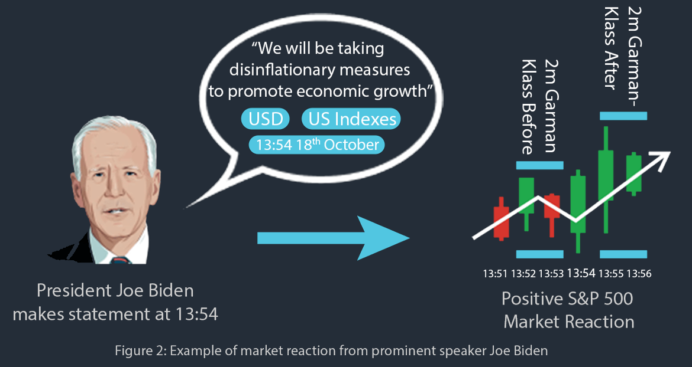

Everyday there are breaking financial news headlines reported by news platforms such as [Financial Juice](https://www.financialjuice.com/). This project aimed to take all tagged historical headlines, and capture the relationship between the time of headlines being released and the market movement afterwards. The methodology of the project is to gather over 100,000 breaking news headlines, and analyse the semantic structure in relation to three years of market time-series data by generating volatility metrics and visualising with topic modelling tools.

To view the interactive map, [head over to the nomic.ai build](https://atlas.nomic.ai/map/9efda517-1095-44f2-8db8-9698f1fc1dc4/f5f14db9-e284-429d-9a81-5d3706ef6c03?xs=-55.17357&xf=53.19966&ys=-30.02962&yf=29.91699)

The interactive map can be split into a two core components, the time series data and the unstructured headline data. For the time series data, we use the open, high, low and close values surrounding the headline release to generate volatility values, which were produced from the Garman-Klass estimator as this considers OHLC data and is more fit for intraday price extremums. A sliding window method was utilised to take the average garman klass volatility at specific time windows (2m, 5m, 15m, 30m and 60m). The headlines were then embedded using Open-AI's embedding tool to workout the simialrity of headlines. The embeddings create 768-dimensional vectors that can be visualised in a 2D plane, where the closer two headlines are in this space, the more similar Open-AI deems them to be.

In addition, we had over 300,000 headlines. Since the majority of these headlines was untagged, we trained a multi label classifier model with the tagged headlines to identify what the tags of the untagged headlines would be. This tagging tool identified the relevant tags for the testing dataset of the tagged headlines with 90% precision.