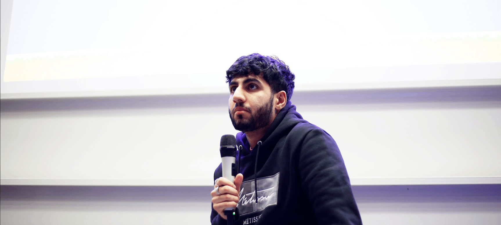

## عدنان قیصر

## Who Am I
My name is Adnan, and I'm an Front-Office Software Engineer at [Global Financial Firm, Macquarie Group](https://www.macquarie.com/). I hold a First-Class Honours in Computer Science with Artificial Intelligence degree at the [University of Sussex](https://www.sussex.ac.uk/). In recent years, my areas of interest have gravitated towards natural language processing and computational finance, with my dissertation titled [“Inventory Forecasting in the Crude Oil Market using Natural Language Processing”](https://adnanquisar.com/crude-oil-inventory-forecasting/).

I have a few years of tech related work experience including summer positions as a Junior Researcher in the [Natural Language Procesing Lab, University of Sussex](https://www.sussex.ac.uk/research/centres/ai-research-group/research/nlp), a Software Engineering Intern at [Cloud Native Core Banking Scale‑Up, Thought Machine](https://www.thoughtmachine.net/). I have also worked full-time as a Software Engineer at a [Real Time Financial News Company, FinancialJuice](https://www.financialjuice.com/) and a Software Developer at [Maritime Data & Analytics Start-Up, Tradeviews](https://tradeviews.net/).

During my time at university, I engaged in extra-curriculars such as being the Vice-President of the computer science society, [HackSussex](https://www.hacksussex.com/), a [Peer Assisted Learning](https://www.sussex.ac.uk/ei/internal/forstudents/informatics/undergraduate/pal) Tutor and a Teaching Assistant for Artificial Intelligence related undergraduate modules. 

## What You Can Find on This Website
Here, I discuss things I'm working on, maintain a record of my personal career and write about things I find interesting. Most recently, I blogged about [25 Things I’d tell myself 10 years ago](/twenty-five-things-id-tell-myself-ten-years-ago/).

## Contact Me
Whether you want to discuss a future career opportunity, work together, or just say hi, my inbox is always open, just [email me](mailto:adnanquisar0@gmail.com).